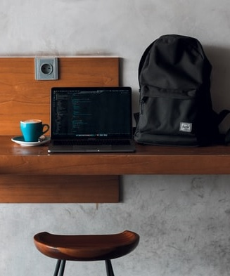

# The Coding House of Espresso - Milestone Project 1

## Table of Contents
1. Project purpose and introduction
2. UXD – User Experience Design
3. Features
4. Technologies and Resources used
5. Testing
6. Project barriers and solutions
7. Version Control
8. Deployment
9. Credits
10. Acknowledgments

## Am I Responsive 

# 1. Project purpose and introduction

This Website was built to perform the first task called Milestone Project 1 defined by Code Institute during the Fullstack Web Developer Course. Under the process of creation used technologies were following languages: HTML and CSS with additional Bootstrap framework.

## The Coding House of Espresso 

[View the live project here](https://maggiedaisy.github.io/MilestoneProject1-The-Coding-House-of-Espresso/)

This project aims to create a responsive website for a coffee shop located in the most popular and attractive district of central Oslo. The website is dedicated to general visitors such as students and digital workers who would like to have their own meeting place while experiencing unforgettable coffee experiences.

# 2. UXD – User Experience Design

### User Stories 

Potential users are customers who want to have a great experience with coffee taste and preparation while discussing new technologies inspirations in a dedicated community. Customers who want to get knowledge about the quality of coffee beans, brewing methods, and equipment used for preparation as well as customers who want to share digital knowledge in the same place.

* As a user of a website, I wish to be able to navigate very easily, so I can find interesting content
* As a user of the website, I wish to be able to learn about the place and provides services, so I can gain information is this place I am looking for
* As a user of the website, I wish to find an accessible contact form, so I can ask bothering questions or subscribe to the newsletter
* As a user of the website, I wish to find information about localization and opening hours, so I can be a guest of a place
* As a user of the website, I wish to have visible access to social media, so I can follow and be a part of the community
* As a user of the website, I wish that design is responsive, so I can look at the page on different size of devices

### Strategy

The main goal of this website is to present and advertise the hangout place or second office, for both, coffee and code enthusiasts. This website is built for a local coffee shop and is dedicated to potential customers who will be interested in buying products and services, as well as spending working or studying time in a dedicated community. To improve the way of easy navigation, the website is constructed to be consistent and intuitive. Content is divided for clearly, visible sections and all navigation elements are clickable. The presentation of place, team, services, and products is giving a clear possibility to find need able information. The design of a website is responsive, so allows viewing page on different devices, as a first-come mobile approach which is very useful for today's generation smartphone users. Contact form and social media icons can be found very easily during the navigation website process.

### Scope

Taking into consideration a beginner level of designing skill ability, the website provides 
Functional requirements - responding to customer first needs, easy to navigate, informative, responsive
Non-functional requirements - contained content includes text and images which provide a functional space for the user.

### Structure 

The presentation of information contained on the website is structured, learnable, and intuitive, first interaction enables quick finding information and orientation between features. The text content is short and consistent and the imagery is simple and clean, both describe place and services very well. Contact section with contact form and footer with social media buttons allow for easy access to be in touch.

### Skeleton

[Wireframes:](https://github.com/MaggieDaisy/MilestoneProject1-The-Coding-House-of-Espresso)
* 1 single page with 5 different content sections and the possibility to navigate between them
* 5 sections called: Home, About, Menu, Shop, Contact
* Header – fixed header with hero image and navigation bar
* Footer – fixed footer with social media icons 

### Surface

Visual experience reflecting coffee texture and coffee color to bring a clean and modern feeling 

Colors
* Neutral tones, like blends of milk and coffee colors, reflecting the served beverages and create a cozy and calm down atmosphere. 
Two main colors such as dark brown and light cream color create visual contrast 

Typography
* Font used for the retro visual experience, selected from google fonts, Inconsolata for whole body content.

Images
* The selection of images has been made to present beverages served in the shop and the design of the place as well as barista team members and potential guests.

# 3. Features

### Existing Features
* Created with HTML5, CSS3 and Bootstrap.
* Website with 5 individual and separate sections which are linked together to create a coherent whole
* A fixed navbar allows to user-easy and intuitive navigating
* A fixed footer allows to user clever access to social media
* Fixed images which are responsive for mobile and desktop view
* Contact Form with a possibility to write the message and subscribe to the newsletter

### Features Left to Implement when skills developed
* Built a real shop page with 'buy here' buttons, once cooperation agreement with sellers is made
* Link to real Social Media which represents shop, once they exist

# 4. Technologies and Resources used 

* Code Institute Fullstack Web Developer Course Content - was used as the main source of fundamental knowledge.
* Code Institute „SLACK” Community - was used as a main source of assistance.
* HTML - HTML5 technology – was used as the main language to create the structure of the Website.
* CSS - CSS3 technology – was used as the main language to style the Website.
* Bootstrap - Bootstrap framework was used throughout this website for navigation bar and responsiveness.
* Font Awesome - Font Awesome Icons was used for the Social media links.
* Google Font - Google Font used throughout this project was Inconsolata
* Gitpod - Integrated Development Environment was used to develop the Website.
* GitHub - GitHub hosting site was used to store the source code for the Website and Git Pages was used for the deployment of the live site.
* Git - Git was used as version control software to commit and push code to the GitHub repository where the source code is stored.
* Google Chrome Developer Tools - this built-in developer tool was used to inspect page elements and help debug issues with the site layout and test different CSS styles.
* Balsamiq Wireframe - these quick and handful tool was used to create wireframes for planning project structure and layout
* Am I Responsive Bookmarklet - Multi Device Website Mockup Generator was used to create the Mockup image for this README
* Make a README – Page with suggestions how to create a good Readme file
* Mastering Markdown – GitHub guide about Markdown. Lightweight and easy-to-use syntax for styling all forms of writing on the GitHub platform. 
* Autoprefixer CSS online - a plugin was used to parses CSS and adds vendor prefixes
* W3C Markup Validation Service - validator was used to check the markup validity of content in HTML or CSS
* Closing Tag Checker for HTML5 - was used to validate if all tags are open and close correctly
* MS1 Planning Session – Recorded and posted on You Tube Zoom session about planning Milestone Project nr 1

# 5. Testing
Will be presented 

# 6. Project barriers and solutions
Will be presented

# 7. Version Control

Git - free and open-source distributed Version Control System was used to show tracking all changes during the coding process. 
Git add, Git commit, Git push commands were used to approve and store files in the repository. 

# 8. Deployment

This project was developed by using GitHub - a code hosting platform and Gitpod - an online Integrated Development Environment. There is no difference between the deployed version and the development version.
The first step was to create a new "Repository" named Milestone project 1 in GitHub. Then once opened in Gitpod the whole process started by creating a structure of files and then the very first boilerplate of code, then successively with time whole code structure. Next, the code was pushed to GitHub where was stored in my Repository. 
### Deployment using GitHub pages:
* Navigate to the Git Hub Repository - [My Repository](https://github.com/MaggieDaisy/MilestoneProject1-The-Coding-House-of-Espresso)
* Then, right under the "Settings" section of the GitHub repository, scroll down to "GitHub Pages" section.
* After, select a "master branch" under "source" drop-down and click "save" button
* Once selected, this publishes the project to GitHub Pages and then you can click to URL link to go directly to the live deployed page
### Deployment using Run Locally:
* The code can be also run locally, optional through clone or download 
* Navigate and open the repository, click on the green "Code" button, and select either "clone" or "download".
* The Clone option provides a URL, which you can use on your desktop IDE.
* The Download ZIP option provides a link to download a ZIP file that can be unzipped, unpacked, and displayed on your local computer.

# 9. Credits

* Content

The text content for this page was created by Malgorzata Czerwonka (self-written) for a non-existing place, and for educational purposes only.
Quotes about coffee and code.

* Media

All the images used in this site were picked from Unsplash (a website dedicated to sharing stock photography for free for every kind of project)

* Code

HTML 
CSS
Bootstrap 

# 10. Acknowledgments

- Inspiration for this project was the previous career experience and accession to the course.  
- I would like to thank my mentor, Sandeep Aggarwal, for advice about starting planning this project ,,, 
- Code Institute tutors for creating content of the course with the possibility of coming back to knowledge, and Slack Community for being available and helpful every single time when needed. 
- Everyone who brought inspiration, ideas, examples, materials, or problem-solving solutions, especially students and leaders like Anna, Jim, Harry, Daisy, Richard, ,,,  

