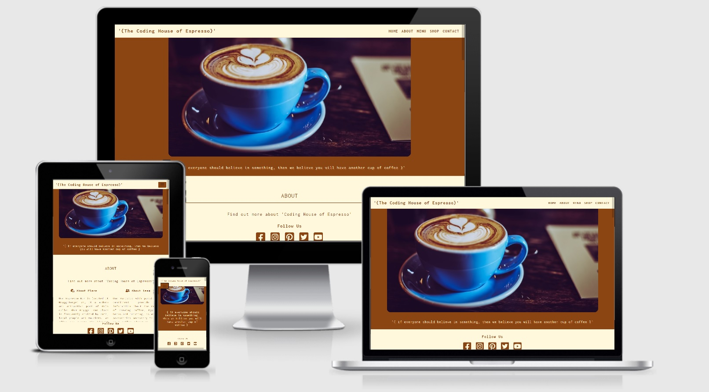

# The Coding House of Espresso - Milestone Project 1

## Table of Contents
1. Project purpose and introduction
2. UXD – User Experience Design
3. Features
4. Technologies and Resources used
5. Testing
6. Project barriers and solutions
7. Version Control
8. Deployment
9. Credits
10. Acknowledgments

# 1. Project purpose and introduction

This Website was built to perform the first task called Milestone Project 1 defined by Code Institute during the Fullstack Web Developer Course. Under the process of creation used technologies were following languages: HTML and CSS with additional Bootstrap framework.

## The Coding House of Espresso 

[**View the live project here**](https://maggiedaisy.github.io/MilestoneProject1-The-Coding-House-of-Espresso/)

This project aims to create a responsive website for a coffee shop located in the most popular and attractive district of central Oslo. The website is dedicated to general visitors such as students and digital workers who would like to have their own meeting place while enjoying unforgettable coffee experiences.

# 2. UXD – User Experience Design

### **User Stories**

Potential users are customers who want to have a great experience with coffee taste and preparation while discussing new technologies inspirations in a dedicated community. Customers who want to get knowledge about the quality of coffee beans, brewing methods, and equipment used for preparation as well as customers who want to share digital knowledge in the same place.

* As a user of a website, I wish to be able to navigate very easily, so I can find interesting content
* As a user of the website, I wish to be able to learn about the place and provides services, so I can gain information is this place I am looking for
* As a user of the website, I wish to find an accessible contact form, so I can ask bothering questions or subscribe to the newsletter
* As a user of the website, I wish to find information about localization and opening hours, so I can be a guest of a place
* As a user of the website, I wish to have visible access to social media, so I can follow and be a part of the community
* As a user of the website, I wish that design is responsive, so I can look at the page on different size of devices

### **Strategy**

The main goal of this website is to present and advertise the hangout place or second office, for both, coffee and code enthusiasts. This website is built for a local coffee shop and is dedicated to potential customers who will be interested in buying products and services, as well as spending working or studying time in a dedicated community. To improve the way of easy navigation, the website is constructed to be consistent and intuitive. Content is divided for clearly, visible sections, and all navigation elements are clickable. The presentation of place, team, services, and products is giving a clear possibility to find need able information. The design of a website is responsive, so allows viewing page on different devices, as a first-come mobile approach which is very useful for today's generation smartphone users. Contact form and social media icons can be found very easily during the navigation website process.

### **Scope**

Taking into consideration a very beginner level of designing skill ability, the website provides:
* Functional requirements - responding to customer first needs, easy to navigate, informative, responsive, intuitive.
* Non-functional requirements - contained content includes text and images which provide a functional space for the user.

### **Structure**

The presentation of information contained on the website is structured, learnable, and intuitive, first interaction enables quick finding information and orientation between features. The text content is short and consistent and the imagery is simple and clean, both describe place and services very well. Contact section with contact form and footer with social media buttons allow for easy access to be in touch. Shop section with buy here buttons takes a user to other aside real existing shops. 

### **Skeleton**

[**Wireframes:**](/assets/docs/Sketch_MS1.pdf)
* 1 single page with 5 different content sections and the possibility to navigate between them
* 5 sections called: Home, About, Menu, Shop, Contact
* Header – fixed header with a hero image, brand name, and navigation bar
* Footer – fixed footer with social media icons 

### **Surface**

Visual experience reflecting the coffee-based beverages color and coffee texture to bring a clean, warm, and retro feeling.
* Colors

Neutral tones, like a blend of milk and coffee colors, reflecting the served beverages and create a cozy and calm down atmosphere. Throughout the whole project were used two main colors, such as dark brown (SaddleBrown #8B4513 rgb(139, 69, 19)) and light cream color (Cornsilk #FFF8DC rgb(255, 248, 220)) to create visual contrast between elements and sections. In addition, one more color was picked, like light brown (SandyBrown #F4A460 rgb(244, 164, 96)) for hover active elements like buying and submit buttons, social media icons, and links til sections.

* Typography

Font 'Inconsolata' used for the retro visual experience for whole-body content, selected from google fonts.

* Images

The selection of images has been made to present beverages and food served in the shop. Image presentation shows an interior design of the place as well as barista team members and potential guests.

# 3. Features

### Existing Features
* Website with 5 individual and separate sections which are linked together to create a coherent whole
* A fixed/sticky-top navbar allows to user-easy and intuitive navigating
* A fixed/sticky-bottom footer allows to user clever access to social media
* Sized images which are responsive for mobile and desktop view
* A 'buy here' button points the user to a familiar but aside shop
* Contact form with a possibility to write the message and subscribe to the newsletter

### Features left to implement when skills developed
* Built a real shop page with 'buy here' buttons, once cooperation agreement with sellers is made
* Link to real Social Media which represents shop, once they exist

# 4. Technologies and Resources used 
* [**Code Institute Fullstack Web Developer Course Content**](https://codeinstitute.net/) - was used as the main source of fundamental knowledge and inspiration.
* [**Code Institute „SLACK” Community**](https://slack.com/intl/en-no/) - was used as a source of assistance.
* **HTML - HTML5 technology** – was used as the main language to create the structure of the Website.
* **CSS - CSS3 technology** – was used as the main language to style the Website.
* [**Bootstrap**](https://getbootstrap.com/) - Bootstrap framework was used as an open-source to create responsive features and modern design of the Website.
* [**Font Awesome**](https://fontawesome.com/) - Font Awesome Icons were used for social media links and marking separate parts of sections.
* [**Google Fonts**](https://fonts.google.com/specimen/Inconsolata) - Google Font used throughout this project was 'Inconsolata'.
* [**Gitpod**](https://www.gitpod.io/) - Integrated Development Environment was used to develop the Website.
* [**GitHub**](https://github.com/) - GitHub hosting site was used to store the source code for the Website, and Git Pages was used for the deployment of the live version of site.
* [**Git**](https://git-scm.com/) - Git was used as version control software to commit and push code to the GitHub repository where the source code is stored.
* [**Stack Overflow**](https://stackoverflow.com/) - was used as a general source of knowledge.
* [**w3schools**](https://www.w3schools.com/howto/default.asp) - especially section 'How to' was used as a general source of knowledge.
* [**Google Chrome Developer Tools**](https://developers.google.com/web/tools/chrome-devtools) - this built-in developer tool was used to inspect page elements and help debug issues with the site layout and test different CSS styles.
* [**Mobile-Friendly Test Tool**](https://search.google.com/test/mobile-friendly) - The Mobile-Friendly test tool was used to check if aplication is designed for mobile devices.
* [**Balsamiq Wireframe**](https://balsamiq.com/wireframes/) - these quick and handful tool was used to create wireframes for planning project structure and layout.
* [**Am I Responsive Bookmarklet**](http://ami.responsivedesign.is/) - Multi Device Website Mockup Generator was used to create the Mockup image for this README file.
* [**Make a README**](https://www.makeareadme.com/) – a page that shows suggestions on how to create a good Readme file.
* [**Mastering Markdown**](https://guides.github.com/features/mastering-markdown/)– GitHub guide about Markdown. Lightweight and easy-to-use syntax for styling all forms of writing on the GitHub platform.
* [**W3C Markup Validation Service**](https://validator.w3.org/) - validator was used to check the markup validity of content in HTML and CSS.
* [**Closing Tag Checker for HTML5**](https://www.aliciaramirez.com/closing-tags-checker/) - was used to validate if all tags are open and close correctly.
* [**HTML and CSS Formatter**](https://webformatter.com/html) - was used to beautify code.
* [**MS1 Planning Session**](https://www.youtube.com/watch?v=sH0m9N875SU&feature=youtu.be) - Zoom session about planning Milestone Project 1, recorded and posted on YouTube by Jim Lynx - was used to structure planning steps for MS1.
* [**Bootstrap Essentials**](https://ajgreaves.github.io/bootstrap-grid-demo/index.html) - Page developed by Anna Greaves - was used as a source for a better understanding of the grid system.
* [**Grammarly**](https://app.grammarly.com/) - a comprehensive writing tool was used as a helper to write clear and correct text.
* [**HTML Color Codes**](https://htmlcolorcodes.com/color-names/) - has been used as a color picker to create a layout on the Website.
* **Microsoft Paint** - a simple raster graphics editor has been used for editing and resizing pictures. 

# 5. Testing
The final result of this project is a front-end web application based on the principles of user experience design, accessibility, and responsivity. 
**This is a static front-end web application developed and implemented by using HTML and CSS with additional Bootstrap elements**, so required testing was conducted on the basis of visual effects and website layout.

_**General testing results:**_

The first step of the testing process was to create the basic framework of this application and check if the attached links work properly. 
* **Brand name link** - has been checked and confirmed that directs the user successfully to the home page. 
* **All links settled in the top navigation panel**  - has been checked that allows the user to flow between individual sections like Home, About, Menu, Shop, Contact.
* **Buy here buttons** nested in the Shop section - has been checked and ensured that directs the user to aside shops and opens in a new tab
* **Contact form** in the Contact section - has been checked and ensured that works as expected, Submit/Send button without entering the required e-mail address shows error and asks the user to fill out this field with input. Also, e-mail address input when tested with the wrong format shows an error and asks the user to fill out the correct input with @. The newsletter agrees on the button was checked and as a result, allows users to make choices about sending information about events organized in the shop. 
* **Social media icons** settled in the footer - has been checked and ensured that points the user to social media main pages and opens in a new tab.

The further tests of the application were about to check responsiveness in all sections using [**Google Chrome Developer Tools**](https://developers.google.com/web/tools/chrome-devtools). Multiple tests on multiple desktop sizes confirmed that first, and a very raw structure works quite well on mobile devices as well as bigger desktop sizes, however, one main problem repeatedly occurred, on devices with small and extra-small resolutions brand name was not displayed properly.

Continuing subsequent tests included a test on mobile devices such as mobile phones, the entire application was checked with Google [**Mobile-Friendly Test Tool**](https://search.google.com/test/mobile-friendly) and showed that the design is friendly to such devices.

When the site developed closer to the final stage, the next test was to check eventually errors in a code validation. Code of the whole site was entered in [**W3C HTML Validator**](https://validator.w3.org/) and the result was no errors but warnings to show. The warnings were about empty alt attributes for images, so was immediately fixed. Then repeated the same procedure in [**W3C CSS Validator**](https://jigsaw.w3.org/css-validator/) and also there were no errors or warnings to show.

Final tests were about to check grammar and spelling throughout the whole site and Readme file, section by section text was run through [**Grammarly**](https://app.grammarly.com/) application and showed several errors to correct.

The tests were conducted mainly with the use of **Google Chrome** browser, recommended during the course. However, the research also covered other browsers such as **Mozilla Firefox**, **Microsoft Edge**, and **Apple Safari**. In general, after inspecting by use of the tools available in each browser, it was found that the application displays correctly and is responsive to different screen sizes. In addition, the test was performed live on devices such as **Huawei P20**, **Samsung Galaxy S10**, **iPhone 11**, **iPad 9.7**, **HP Spectre 13**. The result was very good and shown that on all those screen devices website was responsive and displayed as expected. 

_**Answering to a user story needs:**_ 

* Tests made on the top located navigation bar shown that every person visiting the site will be able to navigate very easily to find interesting content. Clickable links are bringing the user to different sections. 
* Tests made on the separate sections shown that users will be able to learn about the place and provide services in the shop. Additionally, tests performed on buy here buttons allow the user to order products familiar with the main theme. 
* Tests made on a contact form allows user to send to the shop bothering questions or subscribe to the newsletter. The choice was given to the user who can just write a message, just sign up for the newsletter, or use both of these options.
* Tests made on the contact section allows user to find information about localization and opening hours.
* Tests made on footers social media icons allows user to find  visible and easy access to social media. Clickable links are giving the user possibility to observe and join the local community. 
* Tests made on different screen sizes shows that the application is responsive, so the user can look at the page on different devices.

# 6. Project barriers and solutions

* **Navbar** solution borrowed from Boostrap showed several issues that were solved during the development of this application. The brand name was not displaying correctly on small screens, this was solved by using `media query only screen for max-width: 600px`. 
* The navigation links to the individual sections showed a tendency to the left side, which was solved by adding the `justify-content-end` class. 
* The problem also occurred when applying the background color and the font color to the finished navigation borrowed from Bootstrap solution, this was solved with `value !important` which might seem to be overused for this main part of a project to achieve the desired effect. 
* There was also a problem with the automatic closing of the menu button, when after pressing the link it did not close properly and does not return to its place - [screenshot of issue](/assets/docs/navnotclosing.jpg). The solution was to use class `data-toggle="collapse"` and `data-target=". Navbar-collapse"` in the outer div.
* The **home image** for the Home section has been changed several times during the design process. The first and main reason for this was that, from an aesthetic point of view, the photo is too colorful and distracting - [example of previous version](/assets/docs/toppicture.jpg). The first idea to introduce this photo was that it would refer to the main topic of designing a store for programmers and coffee lovers, but finally, after listening to users' opinions, the photo of the main page was changed to a warm and calm background referring to a standard coffee shop.
* **Gallery** solution in the initial phase of the project was to use Slideshow/Carousel, but due to the lack of ability to use JavaScript, a simple solution was used. Container class was introduced to build the visual effect of displaying photos. However, the gallery was not displaying correctly on every device, this was solved by adjusting the size of the photos and adding a `media query` to the appropriate screen sizes.

# 7. Version Control

**Git** - free and open-source distributed **Version Control System** was used to show tracking all changes during the coding process. 
Git add, Git commit, Git push commands were used to approve and store files in the repository. 

# 8. Deployment

This project was developed by using **GitHub** - a code hosting platform and **Gitpod** - an online Integrated Development Environment. There is no difference between the deployed version and the development version.
The first step was to create a new "Repository" named Milestone Project 1 in GitHub. Then once opened in Gitpod the whole process started by creating a structure of files and then the very first boilerplate of code, then successively with time whole code structure. Next, the code was pushed to GitHub where was stored in my Repository. 
### Deployment using GitHub pages:
* Navigate to the Git Hub Repository - **My Repository**
* Then, right under the "Settings" section of the GitHub repository, scroll down to "GitHub Pages" section
* After, select a "master branch" under "source" drop-down and click "save" button
* Once selected, this publishes the project to GitHub Pages and then you can click to URL link to go directly to the live deployed page
### How to use Run Locally:
* The code can be also run locally, optional through clone or download 
* Navigate and open the repository, click on the green "Code" button, and select either "clone" or "download"
* The Clone option provides a URL, which you can use on your desktop IDE
* The Download ZIP option provides a link to download a ZIP file that can be unzipped, unpacked, and displayed on your local computer

# 9. Credits

* Content

The text content for this page was created by student Malgorzata Czerwonka (self-written) for a **non-existing place**, and for **educational purposes only**. Inspiration to create coffee quotes was borrowed from sources:
[**1**](https://www.goodhousekeeping.com/life/g26948562/funny-coffee-quotes/?slide=2) and 
[**2**](https://www.amazon.com/MC2-ENERGY-MILK-COFFEE2-Birthday/dp/B06XZF67ZD)

* Media

All the images used in this site were picked from [**Unsplash**](https://unsplash.com/) - a website dedicated to sharing stock photography for free for every kind of project

* Code
1. Code snippet from [**Bootsrap 4 components**](https://getbootstrap.com/docs/4.0/components/navbar/) for responsive navigation bar
1. Gallery form inspiration was borrowed from course content walkthrough project 'Love Running' by Code Institute
2. Inspiration for footer was borrowed from course content walkthrough project 'Love Running' by Code Institute
3. Inspiration for making footer as a sticky element [**w3schools**](https://www.w3schools.com/howto/howto_css_sticky_element.asp)

# 10. Acknowledgments

- Inspiration for this project was the previous career experience and accession to the course.  
- I would like to thank: Code Institute tutors for creating inspiring content of the course, Slack Community for being available and helpful every single time when needed, especially students and leaders like Anna for educational materials, Jim for constructive zoom session, Harry for a tip to deploy a project in early stage.

